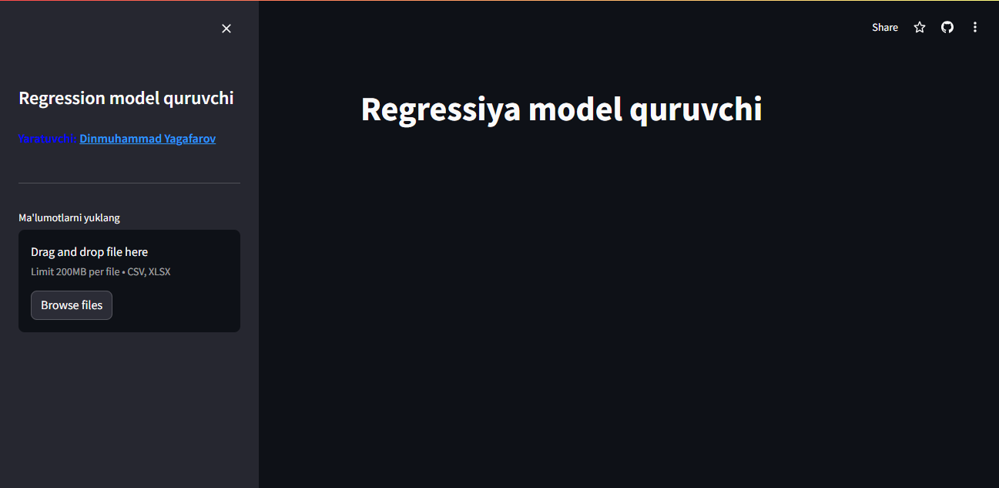
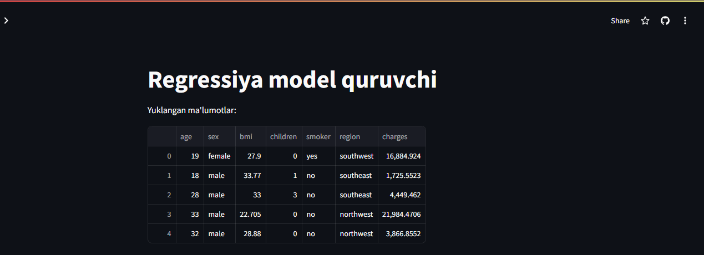
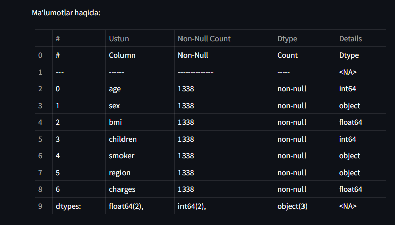
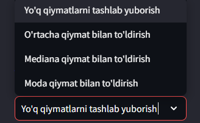
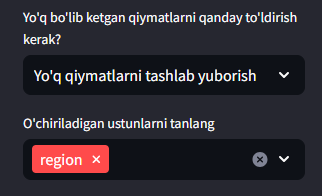
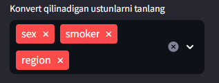
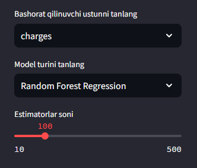
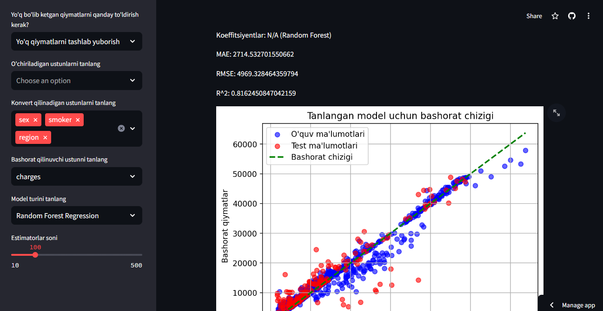
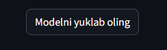

# Regression Models App

## Umumiy ma'lumot

Ushbu Streamlit dasturi foydalanuvchilarga o'z ma'lumotlar to'plamlarini yuklash, yo'q bo'lib ketgan qiymatlarni to'ldirish, ma'lumotlarni oldindan qayta ishlash va turli regressiya modellari yordamida bashorat qilish imkoniyatini beradi. Foydalanuvchilar natijalarni vizuallashtirishi va o'qitilgan modelni yuklab olishlari mumkin.

### Dastur URL manzili

Dasturga [shu yerda](https://regressionmodels.streamlit.app/) kirishingiz mumkin.

## Xususiyatlar

1. **Ma'lumotlarni yuklash**: Foydalanuvchilar CSV yoki Excel fayllarini yuklashlari mumkin.
2. **Ma'lumotlarni oldindan qayta ishlash**:
   - Ma'lumotlar xulosasi va ustunlar haqida ma'lumot olish.
   - Yo'q bo'lib ketgan qiymatlarni turli strategiyalar bilan to'ldirish.
   - Keraksiz ustunlarni o'chirish.
   - Nominal ustunlarni kodlash.
3. **Model tanlash va o'qitish**:
   - Turli regressiya modellari orasidan tanlash: Linear Regression, Ridge Regression, Lasso Regression, Random Forest Regression va Decision Tree Regression.
   - Tren-test bo'linishini sozlash.
4. **Modelni baholash**:
   - Baholash metrikalarini ko'rsatish: MAE, RMSE, R².
   - Bashorat natijalarini haqiqiy qiymatlar bilan taqqoslash.
5. **Modelni yuklash**: O'qitilgan modelni saqlash va yuklab olish.

## O'rnatish

Ushbu dasturni lokal kompyuteringizda ishga tushirish uchun quyidagi qadamlarni bajaring:

1. Repozitoriyani klonlang:
    ```bash
    git clone https://github.com/yagafarov/regressionmodels.git
    cd regressionmodels
    ```

2. Kerakli kutubxonalarni o'rnating:
    ```bash
    pip install -r requirements.txt
    ```

3. Streamlit dasturni ishga tushiring:
    ```bash
    streamlit run app.py
    ```

## Foydalanish

1. **Ma'lumotlarni yuklash**: Yon paneldagi fayl yuklash funksiyasi orqali ma'lumotlaringizni yuklang.
   
   

2. **Ma'lumotlar va ma'lumot olish**: Ma'lumotlaringizning dastlabki qatorlarini va xulosasini ko'ring.
   
   
   

3. **Yo'q bo'lib ketgan qiymatlarni to'ldirish**: Yon paneldagi opsiyalar orqali yo'q bo'lib ketgan qiymatlarni qanday to'ldirishni tanlang.
   
   

4. **Ustunlarni o'chirish**: Yon panel orqali keraksiz ustunlarni tanlang va o'chiring.
   
   

5. **Nominal ustunlarni kodlash**: Nominal ustunlarni tanlang va kodlang.
   
   

6. **Maqsad ustuni va modelni tanlash**: Maqsad ustuni va regressiya modelini tanlang.
   
   

7. **Modelni o'qitish va baholash**: Modelni o'qiting va baholash metrikalari va vizualizatsiyalarni ko'ring.
   
   

8. **Modelni yuklash**: O'qitilgan modelni saqlash va yuklab olish.

	

## Hissa qo'shish

Ushbu dasturni yaxshilash uchun qo'shimchalar va takliflar qabul qilinadi. Taklif yoki yaxshilash uchun GitHubda pull request yoki issue oching.

## Litsenziya

Ushbu loyiha MIT litsenziyasi ostida taqdim etilgan.

---

*Yaratuvchi: [Dinmuhammad Yagafarov](https://t.me/yagafarov)*

*[Portfolio ](https://www.anodra.uz)*
Savollar yoki qo'llab-quvvatlash uchun [Telegram](https://t.me/yagafarov) orqali muallif bilan bog'laning.
